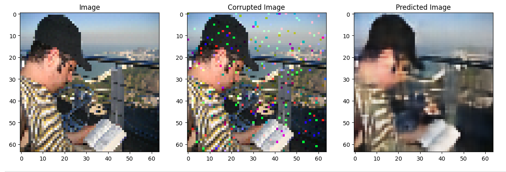

# Advanced Computer Vision Techniques

## Description

This repository showcases the implementation of two computer vision techniques: a Denoising Autoencoder and a Region Proposal Network (RPN). These Jupyter notebooks provide a deep dive into the mechanisms behind image denoising and efficient object detection, demonstrating the power and versatility of deep learning in image processing tasks.

## Notebooks Overview

- **DenoisingAutoEncoder.ipynb**: Offers a deep dive into the design, implementation, and training of a Denoising Autoencoder. It emphasizes the use of TensorBoard for tracking model performance, featuring a comprehensive guide on interpreting loss graphs and adjusting model parameters for optimal denoising results.

- **RPN_Implementation.ipynb**: Provides a step-by-step tutorial on building a Region Proposal Network from the ground up. This notebook covers everything from data preprocessing to model training on a sample dataset, elucidating the practical aspects of developing effective object detection systems.

## Key Features

- **In-depth Tutorials**: Each notebook serves as a detailed tutorial, walking through the theory and practice of constructing and training deep learning models in computer vision.
- **Performance Tracking**: Demonstrates the application of TensorBoard for real-time tracking of model performance, with guidance on how to leverage visual data for model improvement.

## Installation

To get started with these notebooks, you will need Python and Jupyter installed on your system. Clone this repository and install the required dependencies:

```bash
git clone https://github.com/relar-Ritik/Computer-Vision.git
cd Computer-Vision
pip install -r requirements.txt
```

## Usage

Navigate to the cloned repository's directory and start Jupyter Notebook:

```bash
jupyter notebook
```

Open either \`DenoisingAutoEncoder.ipynb\` or \`RPN_Implementation.ipynb\` to begin exploring the techniques discussed.

## Requirements

This project is built using Python 3.x and requires the following libraries:
- PyTorch (for deep learning models)
- NumPy (for numerical computations)
- Matplotlib (for data visualization)
- OpenCV (for image processing)
- Jupyter (for interactive notebooks)


## Example Images:
### Object Detection:

### Image Denoising:
